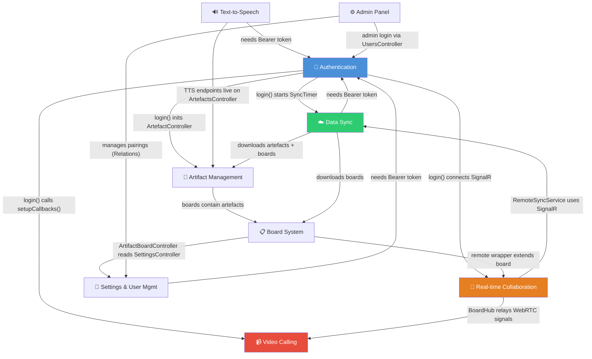
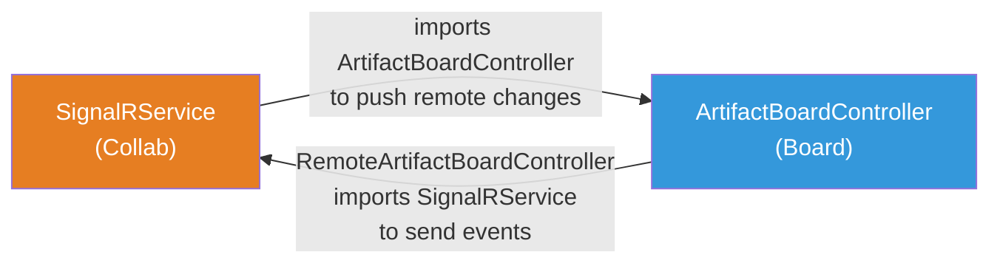
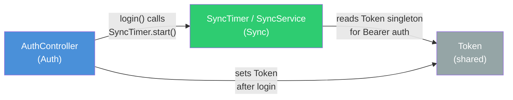
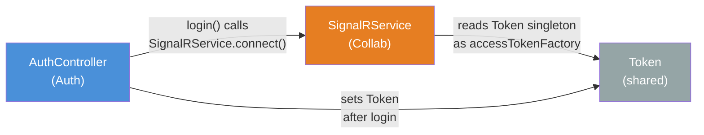
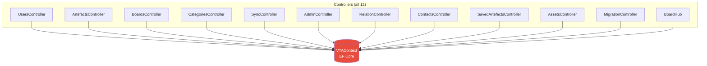

# Cross-Feature Dependency Map

> Generated as part of **Step 4** from [plan.md](../plan.md).
> Maps how the 9 features depend on each other, which services cut across features, and where architectural cycles exist.

---

## Table of Contents

1. [Feature Dependency Graph](#1-feature-dependency-graph)
2. [Shared Services Heat Map](#2-shared-services-heat-map)
3. [Circular Dependencies](#3-circular-dependencies)
4. [Backend Coupling (No Service Layer)](#4-backend-coupling)
5. [Coupling Hotspots](#5-coupling-hotspots)

---

## 1. Feature Dependency Graph



### Reading the Graph

- **Authentication** is the root dependency — all 8 other features require a valid JWT token.
- **AuthController.login()** is an orchestration bottleneck: it starts 4 feature lifecycles (Sync, Collab, Video callbacks, Artifact loading) in a single method.
- **Text-to-Speech** is the most isolated feature — depends only on Artifact Management (endpoints live on `ArtefactsController`) and Authentication (Bearer token).
- **Video Calling** has no direct dependents — it's a leaf node layered on top of Real-time Collaboration.
- **Board System ↔ Real-time Collaboration** have the tightest coupling (bidirectional imports; see [§3](#3-circular-dependencies)).

---

## 2. Shared Services Heat Map

Six services are imported by 3+ features. These are the true cross-cutting infrastructure of the codebase.

| Shared Service | Importers | Features | Auth | Artifact | Board | Collab | Video | TTS | Admin | Sync | Settings |
|---------------|-----------|----------|------|----------|-------|--------|-------|-----|-------|------|----------|
| **VTAContext** (backend) | 12 | 9/9 | ✅ | ✅ | ✅ | ✅ | ✅ | ✅ | ✅ | ✅ | ✅ |
| **Token** (Flutter) | 19 | 7/9 | ✅ | ✅ | ✅ | ✅ | | | | ✅ | ✅ |
| **ApiProvider** (Flutter) | 14 | 6/9 | ✅ | ✅ | ✅ | | | ✅ | | ✅ | ✅ |
| **SignalRService** (Flutter) | 14 | 6/9 | ✅ | | ✅ | ✅ | ✅ | | | ✅ | ✅ |
| **DataRepository** (Flutter) | 7 | 5/9 | ✅ | | ✅ | ✅ | | | | ✅ | ✅ |
| **UserInfo** (Flutter) | 6 | 4/9 | ✅ | ✅ | | | | | | ✅ | ✅ |

### DI Registration Inconsistency

Only 4 of ~10 singleton-like services are registered through GetIt (the project's DI container). The rest use ad-hoc patterns:

| Pattern | Services | Count |
|---------|----------|-------|
| **GetIt `registerSingleton`** | `Token`, `UserInfo`, `ApiProvider`, `ArtefactController` | 4 |
| **Factory constructor singleton** | `SyncTimer`, `SyncService` | 2 |
| **Static `_instance` + private constructor** | `SignalRService`, `RemoteSyncService` | 2 |
| **Manual construction (no DI)** | `AuthController`, `SettingsController`, `CallManager`, `VideoCallManager` | 4 |

This inconsistency means there is no single place to see all service lifetimes, making it hard to reason about initialization order or mock services for testing. See [improvement_proposals.md §6](../improvement_proposals.md#6-tight-coupling--di-patterns) for the consolidation proposal.

---

## 3. Circular Dependencies

Three dependency cycles exist between features. Two are **runtime cycles** mediated through singletons (different fix strategy) and one is a **compile-time bidirectional import** (more urgent).

### 3a. 🔴 Compile-Time Cycle: Real-time Collaboration ↔ Board System



**Evidence:**
- `signalr_service.dart` → `import '.../artifact_board_controller.dart'` — holds a `_ownerBoardController` reference
- `remote_artifact_board_controller.dart` → `import '.../signalr_service.dart'` — calls SignalR methods to send board updates

**Impact:** Tightest coupling in the codebase. Cannot test either feature in isolation. `SignalRService` (a transport layer) has direct knowledge of board domain logic.

**Recommended fix:** Extract a `BoardEventListener` interface that `SignalRService` calls without importing the concrete controller. `ArtifactBoardController` implements the interface. SignalR remains transport-only.

```
SignalRService → BoardEventListener (interface)
                        ↑ implements
              ArtifactBoardController
```

---

### 3b. 🟠 Runtime Cycle: Authentication ↔ Data Sync



**Evidence:**
- `auth_controller.dart` → `import '.../sync_timer.dart'` — starts sync after login
- `sync_service.dart` → `import '.../token.dart'` — reads token for every API call

**Impact:** Auth controls Sync's lifecycle directly. Sync cannot start independently (e.g., from a different entry point). Not a compile-time cycle (mediated through the `Token` singleton), but it creates a tight runtime dependency.

**Recommended fix:** Use an event/callback pattern. Auth emits a `LoginSuccess` event; `SyncTimer` subscribes and starts itself. Auth no longer imports `SyncTimer`.

---

### 3c. 🟠 Runtime Cycle: Authentication ↔ Real-time Collaboration



**Evidence:**
- `auth_controller.dart` → `import '.../signalr_service.dart'` — connects SignalR after login
- `signalr_service.dart` → `import '.../token.dart'` — reads JWT for SignalR's `accessTokenFactory`

**Impact:** Same pattern as Auth ↔ Sync. Auth orchestrates Collab's lifecycle. Additionally, `AuthController.login()` also calls `CallManager.setupCallbacks()`, meaning **one method controls the lifecycle of 3 other features**.

**Recommended fix:** Same event pattern. Auth emits `LoginSuccess`; `SignalRService` and `CallManager` subscribe independently. This also decouples `AuthController` from the `call_manager` import.

---

### Summary: Cycle Fix Strategy

| Cycle | Type | Fix Pattern | Effort |
|-------|------|-------------|--------|
| Collab ↔ Board | Compile-time import | Extract `BoardEventListener` interface | Medium |
| Auth ↔ Sync | Runtime (via singleton) | Event bus / callback subscription | Small |
| Auth ↔ Collab | Runtime (via singleton) | Event bus / callback subscription | Small |

The Auth runtime cycles (3b + 3c) can be fixed together by introducing a single `AuthEventBus` that `SyncTimer`, `SignalRService`, and `CallManager` all subscribe to, eliminating three imports from `AuthController`.

---

## 4. Backend Coupling

### No Service Layer

All 11 API controllers and the `BoardHub` inject `VTAContext` (EF Core DbContext) directly. There are **zero service interfaces** and **zero repository abstractions** on the backend.



**Impact:**
- Business rules are embedded in HTTP handlers and cannot be reused across controllers (the root cause of the duplicate pairing CRUD in `AdminController` + `RelationController`)
- Unit testing requires the full ASP.NET pipeline or an in-memory database — no mockable interfaces
- Changing a database schema requires touching every controller that queries the affected table

**Backend DI registrations** (from `Program.cs`):

| Registration | What |
|-------------|------|
| `AddControllers()` | Auto-discovers `[ApiController]` classes |
| `AddDbContext<VTAContext>()` | EF Core with MySQL |
| `AddHttpClient()` | HTTP client factory (used by controllers for ElevenLabs) |
| JWT middleware | Authentication / Authorization |

`ElevenLabsService` is the only class extracted from controllers into a separate file, but it is **not registered in DI** — it is `new`-ed inline within controller methods. Every domain operation runs inline in controllers.

See [improvement_proposals.md §2](../improvement_proposals.md#2-missing-backend-service-layer) for the service layer proposal.

---

## 5. Coupling Hotspots

### God Classes

Seven files exceed 450 LOC and participate in multiple features:

| File | Lines | Features | Role |
|------|-------|----------|------|
| `RemoteArtifactBoardController` | 1,209 | Collab + Board | Wraps board controller for remote sessions |
| `SyncService` (Dart) | 1,009 | Sync + Artifact + Board | Orchestrates all data synchronisation |
| `ArtefactsController.cs` | 795 | Artifact + TTS | CRUD + image resize + sound convert + TTS |
| `BoardsController.cs` | 759 | Board + Artifact | Board CRUD + saved artefact management |
| `BoardHub.cs` | 584 | Collab + Video | SignalR hub + sessions + WebRTC relay |
| `SignalRService` (Dart) | 532 | Collab + Video + Board | Connection + all event handlers |
| `UsersController.cs` | 458 | Auth + Settings | Login + signup + CRUD + settings + JWT |

### AuthController as Orchestration Bottleneck

`AuthController.login()` is a single method that starts 4 feature lifecycles:

```
login() {
  1. Authenticate → set Token singleton
  2. ArtefactController.loadArtefacts()      // Artifact Management
  3. SyncTimer().start()                      // Data Sync
  4. SignalRService().connect()               // Real-time Collaboration
  5. CallManager().setupCallbacks()           // Video Calling
}
```

This makes `AuthController` a coupling hub — it imports 4 unrelated services. The event bus fix proposed in [§3](#3-circular-dependencies) would reduce its import count from ~8 to ~3.

### Duplicate Logic Creating Implicit Coupling

When the same business rule is implemented in two places, changes must be synchronised manually — a form of implicit coupling:

| Duplicated Logic | Location A | Location B | Risk |
|-----------------|------------|------------|------|
| Pairing CRUD | `AdminController` | `RelationController` | Different filtering (IsActive), different DTOs |
| Contacts lookup | `ContactsController` | `UsersController.GetRelatedContacts` | Identical logic, two routes |
| User deletion | `AdminController.DeleteUser` | `UsersController.DeleteUser` | Admin version skips asset cleanup |
| TTS generation | Backend `ElevenLabsService` | Flutter `ElevenLabsService` | API key exposed on client |

See [improvement_proposals.md §3](../improvement_proposals.md#3-duplicated-logic) for consolidation proposals.
