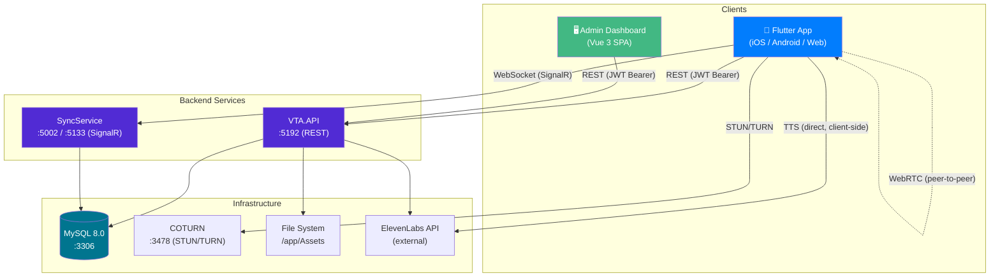
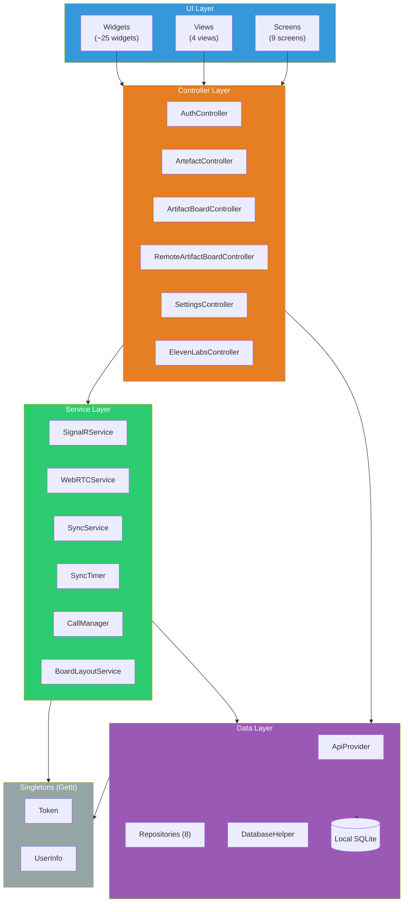
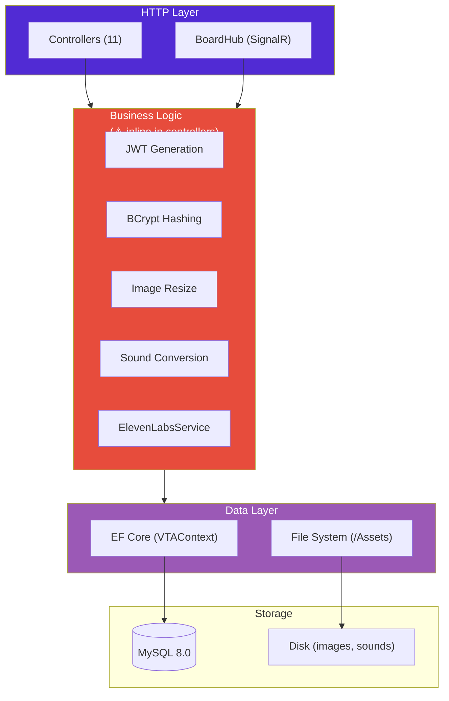
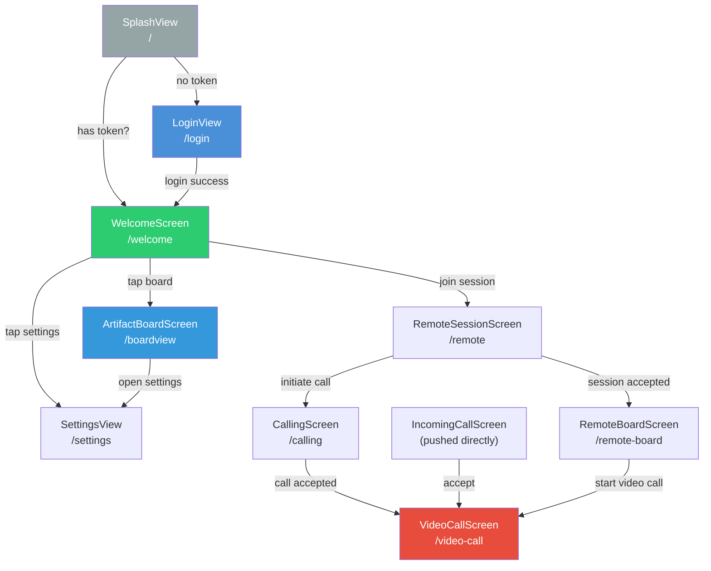
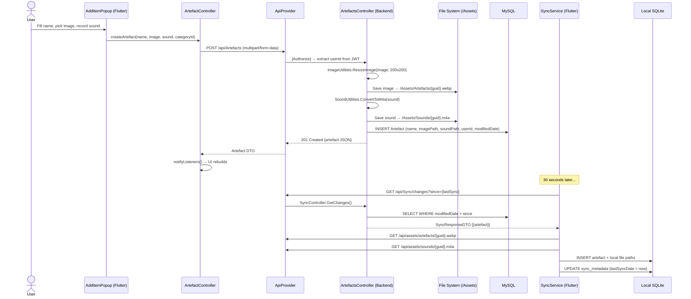

# Architecture Overview

> Generated as part of **Step 5** from [plan.md](../plan.md).
> Synthesised from 9 feature docs, the dependency map, and direct source code inspection.

---

## Table of Contents

1. [Architecture Style](#1-architecture-style)
2. [System Diagram](#2-system-diagram)
3. [Layer Diagram](#3-layer-diagram)
4. [Navigation Structure (Flutter)](#4-navigation-structure-flutter)
5. [State Management](#5-state-management)
6. [Data Flow — End-to-End Example](#6-data-flow--end-to-end-example)
7. [Tech Debt Summary](#7-tech-debt-summary)
8. [Glossary](#8-glossary)

---

## 1. Architecture Style

**Multi-tier client-server with a real-time layer.**

The system has three independently deployed frontend/client applications that communicate with two backend services:

| Component | Technology | Role |
|-----------|-----------|------|
| **VTA.API** | ASP.NET Core 8 | REST API — auth, CRUD, file storage, TTS |
| **SyncService** | ASP.NET Core 8 + SignalR | Real-time hub — board collaboration, WebRTC signaling |
| **Flutter App** | Flutter 3.x (iOS, Android, Web) | Primary end-user client |
| **Admin Dashboard** | Vue 3 + Pinia + TypeScript | Admin-only web UI |
| **MySQL** | MySQL 8.0 | Shared relational database |
| **COTURN** | coturn | STUN/TURN server for WebRTC NAT traversal |

Key architectural characteristics:
- **Offline-first (Flutter):** Local SQLite database with bidirectional polling sync (30s interval)
- **Real-time (SignalR):** Persistent WebSocket connections for board state, session management, and WebRTC signaling
- **No backend service layer:** All 12 server-side entry points (11 controllers + 1 SignalR hub) inject the EF Core DbContext directly
- **No API gateway:** Both backend services are exposed directly; clients know both addresses

---

## 2. System Diagram

### Port Map (Docker Compose)

| Service | Container Port | Host Port | Protocol |
|---------|---------------|-----------|----------|
| VTA.API | 8080 | **5192** | HTTP (REST) |
| SyncService | 8080 | **5002** | HTTP (WebSocket/SignalR) |
| MySQL | 3306 | **3306** | MySQL |
| COTURN | 3478 | **3478** | UDP+TCP (STUN/TURN) |
| COTURN relay | 49160–49200 | 49160–49200 | UDP (media relay) |

> **Note:** In local development (non-Docker), `VTA.API` runs on `:5192` and `SyncService` on `:5133` (from `launchSettings.json`). Docker maps them to `:5192` and `:5002` respectively.

---

## 3. Layer Diagram

### Flutter App Layers

### Backend Layers

> ⚠️ The "Business Logic" box is conceptual — these operations are **not** extracted into service classes. They run inline within controller action methods. See [dependency_map.md §4](dependency_map.md#4-backend-coupling).

---

## 4. Navigation Structure (Flutter)

The Flutter app uses imperative `Navigator.push` / named-route navigation (no declarative router).

### Entry Point

`main()` in `main.dart` initialises:
1. `GlobalConfiguration` from `assets/cfg/app_settings.json`
2. SQLite database (mobile only)
3. GetIt singletons: `Token`, `UserInfo`, `ApiProvider`, `ArtefactController`
4. Manual construction: `SettingsController`, `AuthController`
5. `CameraManager`, `NotificationService`
6. Legacy `Provider` state: `AuthState`, `ArtifactState`, `UserState`

Then runs `MyApp` with `initialRoute: SplashView.routeName`.

### Route Registration

All routes are defined in `MyApp.onGenerateRoute()` in `app.dart` using a `switch` statement — not a route table or declarative router. Routes: `/` (splash), `/login`, `/settings`, `/welcome`, `/boardview`, `/remote`, `/calling`, `/remote-board`, `/video-call`.

`IncomingCallScreen` is **not** registered as a named route — it's pushed directly by `CallManager` via `MyApp.navigatorKey.currentState!.push()`.

---

## 5. State Management

Three distinct patterns coexist in the Flutter app:

| Pattern | Used By | Scope |
|---------|---------|-------|
| **GetIt singletons** | `Token`, `UserInfo`, `ApiProvider`, `ArtefactController` | App-wide, registered in `main()` |
| **ChangeNotifier** (via `ListenableBuilder`) | `SettingsController`, `AuthController`, `ArtifactBoardController`, `RemoteArtifactBoardController`, `ElevenLabsController` | Feature-scoped, passed via constructors |
| **Provider** (legacy) | `AuthState`, `ArtifactState`, `UserState` | App-wide via `MultiProvider`, appears unused by main code paths |

### Backend State

| Component | State Mechanism |
|-----------|----------------|
| VTA.API | Stateless — JWT auth, no server-side sessions |
| SyncService (BoardHub) | **Static mutable collections** — 5 `Dictionary<>` fields + 1 `List<>` field (plain, not concurrent). In-memory only, lost on restart, not shared across instances |

### Admin Dashboard State

| Pattern | Used By |
|---------|---------|
| **Pinia store** | `useAuthStore` — holds JWT token, login/logout |
| **Axios interceptor** | Auto-injects Bearer token from auth store |
| **Component-local `ref()`** | Each view fetches its own data on mount |

---

## 6. Data Flow — End-to-End Example

**Scenario:** User creates an artefact with an image and sound, which later syncs to another device.

---

## 7. Tech Debt Summary

Aggregated from all per-feature architectural concerns and the dependency map. See [improvement_proposals.md](../improvement_proposals.md) for full remediation proposals.

### By Category

| Category | Count | Severity Distribution | Key Examples |
|----------|-------|-----------------------|-------------|
| **God classes** | 7 | 7× 🔴 | `RemoteArtifactBoardController` (1,209 LOC), `SyncService` (1,009 LOC) |
| **Missing abstractions** | 3 | 3× 🔴 | No backend service layer, no repository interfaces, no event bus |
| **Duplicated logic** | 4 | 2× 🔴 2× 🟠 | Pairing CRUD, contacts endpoint, user deletion, dual TTS path |
| **Security** | 4 | 2× 🔴 2× 🟠 | Mock auth bypass, API key on client, hardcoded TURN creds, JWT secret in config |
| **Circular dependencies** | 3 | 1× 🔴 2× 🟠 | Collab ↔ Board (compile-time), Auth ↔ Sync, Auth ↔ Collab |
| **Scalability** | 4 | 1× 🔴 3× 🟡 | BoardHub static state, no pagination, no sync backoff, no transactions |
| **DI / Coupling** | 4 | 1× 🟠 3× 🟡 | 4 singleton patterns, `CallManager` → `MyApp`, AuthController orchestration bottleneck |
| **Logging** | 3 | 1× 🟠 2× 🟡 | `Console.WriteLine` in production, `print()` everywhere, empty catch blocks |
| **Incomplete features** | 3 | 3× 🟡 | `themeMode()` stub, localization commented out, profile pic not synced |

### Priority Summary (from improvement_proposals.md)

| Priority | What | Effort |
|----------|------|--------|
| **P0 — Now** | Mock auth bypass, API key on client, orphaned assets on admin delete, BoardHub static state | Small–Medium |
| **P1 — Next Sprint** | Backend service layer, god class splits, duplicate logic consolidation | Large |
| **P2 — Soon** | Pagination, sync reliability (backoff, retry, transactions), structured logging | Medium |
| **P3 — Backlog** | Token refresh, DI consistency, state management consolidation, profile picture sync | Medium–Large |

---

## 8. Glossary

| Term | Definition |
|------|-----------|
| **Artefact** | A visual/audio item (image + optional sound + name) belonging to a user. The primary content unit. Stored in `Artefacts` table + `/Assets/` filesystem. |
| **Board** | A layout container for artefacts. Two types exist: TalkingMat (grid) and LinearBoard (horizontal strip). Stored in `SavedBoards` table. |
| **SavedArtefact** | A placement record linking an artefact to a board at a specific position (X, Y, scale, rotation). Stored in `SavedArtefacts` table. |
| **Category** | A grouping for artefacts, each with a name and optional image. Users have default categories. |
| **TalkingMat** | A board type where artefacts are arranged in a free-form grid layout. |
| **LinearBoard** | A board type where artefacts are arranged in a horizontal strip with a configurable number of slots (`FieldCount`). |
| **Relation** | A caregiver-child pairing stored in `Relations` table. Has an `IsActive` flag for soft-delete. |
| **Session** | A real-time collaboration session managed by `BoardHub`. Two users share a board view over SignalR. |
| **BoardHub** | The SignalR hub (`SyncService`) managing sessions, board state sync, and WebRTC signal relay. |
| **TURN** | Traversal Using Relays around NAT — the relay protocol used when peer-to-peer WebRTC connections fail. Provided by COTURN. |
| **Caregiver** | A user with role `Caregiver` who manages one or more children and can initiate sessions. |
| **Child** | A user with role `Child` who uses boards/artefacts and receives session invitations from caregivers. |
| **Admin** | A user with role `Admin` who manages users and pairings via the admin dashboard. |
| **FieldCount** | User setting controlling how many artefact slots appear in a LinearBoard (default: 4, options: 2/4/6/8). |
| **NameVisible** | User setting controlling whether artefact names are shown under images (maps to `textUnderImages` in Flutter). |
| **SyncTimer** | A Flutter singleton that fires `SyncService.autoSync()` every 30 seconds to keep the local SQLite database in sync with the backend. |
| **GetIt** | The service locator / dependency injection container used in the Flutter app. |
| **Pinia** | The state management library used in the Vue 3 admin dashboard. |
