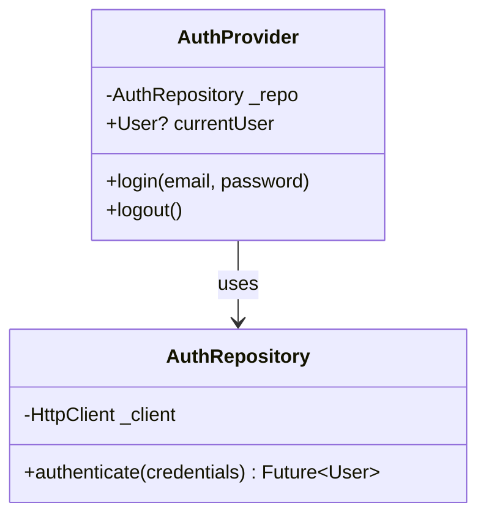
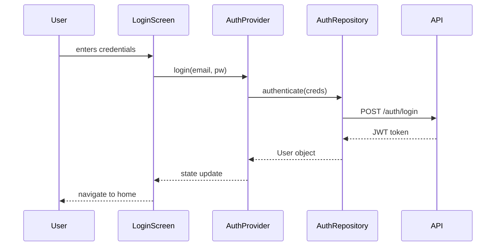
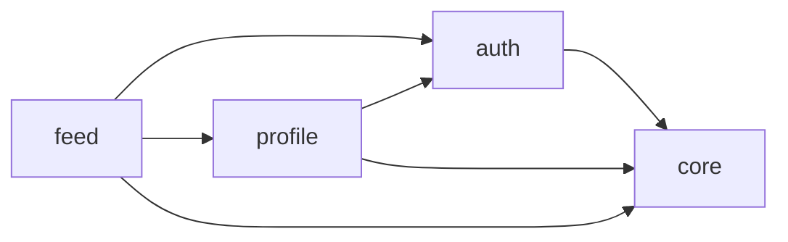

# Systematic Codebase Documentation with Claude Code

A step-by-step guide for using Claude Code to generate comprehensive documentation and diagrams for a messy Flutter/Dart codebase.

## Overview

The approach uses Claude Code as an agentic tool to walk through a Flutter/Dart codebase systematically, generating per-class documentation, interaction diagrams, and architecture-level overviews. The process is broken into multiple passes to keep things manageable and consistent.

## Prerequisites

- Claude Code installed and configured (`npm install -g @anthropic-ai/claude-code`)
- Your Flutter/Dart project in a git repository
- A `docs/` folder created at the project root

## Step 0: Prepare the Codebase

Before starting, create the output structure:

```
docs/
├── classes/          # Per-class documentation cards
├── features/         # Feature-level diagrams and summaries
├── architecture/     # High-level architecture docs
└── _index.md         # Master index (generated last)
```

Identify what to exclude. Create a `.claudeignore` or tell Claude Code to skip:

- `*.g.dart` (generated code)
- `*.freezed.dart` (Freezed generated code)
- `build/`
- `.dart_tool/`
- Test files (document separately if needed)

## Step 1: Inventory Pass

**Goal:** Get a structured map of every class, enum, mixin, and extension in the codebase.

**Prompt for Claude Code:**

```
Walk through every .dart file in lib/ (excluding *.g.dart, *.freezed.dart, and build/).

For each file, extract:
- File path
- All classes, enums, mixins, and extensions defined
- Their superclasses/implemented interfaces/mixed-in mixins
- Imports (only project-internal ones, skip dart: and package: imports unless they are state management or architecture packages like provider, riverpod, bloc, get_it, etc.)

Write the result as a single file: docs/inventory.json

Use this schema:
{
  "files": [
    {
      "path": "lib/features/auth/login_screen.dart",
      "classes": [
        {
          "name": "LoginScreen",
          "type": "class",
          "extends": "StatefulWidget",
          "implements": [],
          "mixins": [],
          "methods": ["build", "initState", "_onSubmit"],
          "fields": ["_emailController", "_passwordController"],
          "uses_codegen": false
        }
      ],
      "internal_imports": ["lib/features/auth/auth_provider.dart"],
      "notable_packages": ["flutter_riverpod"]
    }
  ]
}

Do NOT document the classes yet — just build the inventory.
```

## Step 2: Per-Class Documentation

**Goal:** Generate a documentation card for every non-trivial class.

> **⚠️ Critical: Work one feature folder at a time.**
> Do NOT ask Claude Code to document the entire codebase in a single prompt. Large codebases will exceed context limits, produce shallow or hallucinated docs, and give you no opportunity to course-correct. Instead, run this step once per feature folder. After each folder, review the output, fix any issues in the prompt, and move on. This is the longest step — budget time accordingly.

### 2a: List the folders to process

Start by asking Claude Code to give you a work plan:

```
Read docs/inventory.json. List all unique feature folders under lib/,
how many classes each contains, and suggest an order to document them
(dependencies-first: start with core/shared folders, then features that
depend on them).

Write this as a checklist to docs/progress.md so I can track what's done.
```

This gives you something like:

```
- [ ] lib/core/ (12 classes)
- [ ] lib/models/ (8 classes)
- [ ] lib/services/ (6 classes)
- [ ] lib/features/auth/ (9 classes)
- [ ] lib/features/profile/ (7 classes)
- [ ] lib/features/feed/ (14 classes — consider splitting)
...
```

### 2b: Document one folder at a time

For each folder, use this prompt (replacing the path each time):

```
Read docs/inventory.json. Document ONLY the classes in lib/features/auth/
(and no other folders).

For each class, read the actual source file and generate a documentation
card as a markdown file in docs/classes/.

Use the filename pattern: docs/classes/{feature_folder}_{class_name}.md

Use this template for each class:

---

# {ClassName}

**File:** `{file_path}`
**Type:** {class | abstract class | enum | mixin | extension}
**Extends:** {superclass or "—"}
**Implements:** {interfaces or "—"}
**Mixins:** {mixins or "—"}

## Purpose

{1-3 sentences: what is this class responsible for? What role does it play?}

## Fields / State

| Field | Type | Description |
|-------|------|-------------|
| ... | ... | ... |

## Key Methods

| Method | Description |
|--------|-------------|
| ... | ... |

## Dependencies

- {List of other project classes this depends on, with one-line explanation of why}

## Notes

- {Any code smells, TODOs, or observations about the class}
- {Whether it uses code generation (Freezed, json_serializable, etc.)}

---

Rules:
- Skip trivial widget classes that are just layout wrappers with no logic
  (note them in a separate file: docs/skipped_widgets.md)
- For StatefulWidget pairs, document the State class as the primary and
  reference the widget
- Be factual — describe what the code DOES, not what it should do
- If a class is confusing or seems to violate single responsibility,
  note that under "Notes"

When finished, list which classes you documented and which you skipped.
```

### 2c: Review, then repeat

After each folder:

1. **Spot-check 3-5 class cards** against the actual source. Are the descriptions accurate? Are dependencies correct? Are fields/methods complete?
2. **Fix the prompt** if you see systematic issues (e.g., Claude Code is being too verbose, missing certain patterns, or misidentifying responsibilities).
3. **Mark the folder as done** in `docs/progress.md`.
4. **Use `/clear`** if the conversation is getting long, then point Claude Code at the next folder.

Repeat until all folders are documented.

## Step 3: Feature-Level Interaction Diagrams

**Goal:** Generate Mermaid diagrams showing how classes within each feature interact.

**Prompt for Claude Code:**

```
For each feature folder under lib/, read all the class documentation cards
you generated in docs/classes/ for that feature.

Then read the actual source files again and generate two diagrams per feature
in docs/features/{feature_name}.md:

### 1. Class Diagram (Mermaid)

Show inheritance, composition, and dependency relationships between classes
in this feature. Include key fields and methods. Example:



### 2. Sequence Diagram (Mermaid)

Pick the most important user-facing flow in this feature (e.g., login,
creating an item, navigating) and diagram the sequence of calls. Example:



### 3. Feature Summary

Write a 1-paragraph summary of what this feature does, its main entry points,
and any cross-feature dependencies.

Rules:
- Keep diagrams readable — if a feature has 15+ classes, split into
  sub-diagrams by responsibility
- Highlight any circular dependencies or tight coupling you notice
- Note which state management pattern the feature uses
```

## Step 4: Cross-Feature Dependencies

**Goal:** Map how features depend on each other.

**Prompt for Claude Code:**

```
Read all feature documentation in docs/features/. Read the inventory in
docs/inventory.json.

Generate docs/architecture/dependency_map.md containing:

1. A Mermaid flowchart showing which features depend on which other features:



2. A dependency table:

| Feature | Depends On | Depended On By |
|---------|-----------|----------------|
| core | — | auth, profile, feed |
| auth | core | profile, feed |

3. Shared services / singletons — list any classes used across 3+ features

4. Red flags:
   - Circular dependencies between features
   - Features that depend on too many other features
   - God classes used everywhere
```

## Step 5: Architecture Overview

**Goal:** Synthesize everything into a high-level architecture document.

**Prompt for Claude Code:**

```
Read all documentation generated so far:
- docs/inventory.json
- docs/features/*.md
- docs/architecture/dependency_map.md

Generate docs/architecture/overview.md containing:

1. **Architecture Style** — What pattern does this codebase follow?
   (Clean Architecture, MVC, feature-first, layer-first, or "organic mess"?)

2. **Layer Diagram** — Mermaid diagram showing the architectural layers
   (UI, state management, domain/business logic, data/repository, external services)

3. **Navigation Structure** — How does the app navigate between screens?
   Mermaid flowchart of the main navigation paths.

4. **State Management** — What state management approach(es) are used?
   Is it consistent across features or mixed?

5. **Data Flow** — How does data flow from API/database to UI?
   One representative Mermaid sequence diagram.

6. **Tech Debt Summary** — Aggregate all the red flags and code smells
   noted in previous passes into a prioritized list.

7. **Glossary** — Key domain terms used in the codebase with definitions.
```

## Step 6: Generate Master Index

**Prompt for Claude Code:**

```
Generate docs/_index.md as a master table of contents linking to all
generated documentation. Organize by:

1. Architecture overview (link to overview.md)
2. Dependency map (link to dependency_map.md)
3. Features (links to each feature doc)
4. Classes (links to each class card, grouped by feature)
5. Skipped widgets (link to skipped_widgets.md)

Include a "generated on" date and note that this was auto-generated.
```

## Tips for Working with Claude Code

- **The folder-by-folder approach is non-negotiable for large codebases.** This is the single most important thing in this guide. Asking Claude Code to document 100+ classes in one pass will produce garbage. The sub-task structure in Step 2 exists for a reason — use it.
- **Work one step at a time.** Don't paste all prompts at once. Complete each pass, review the output, and course-correct before moving on.
- **Use `/clear` between major passes** if the context gets too long, but make sure Claude Code re-reads the previously generated docs.
- **Spot-check aggressively.** After each folder in Step 2, pick 3-5 class docs and verify them against the actual code. If there are systematic errors, correct the prompt and re-run.
- **Version control the docs.** Commit after each pass so you can diff and roll back.
- **Re-run periodically.** As you clean up the codebase, re-run passes to keep docs in sync.

## Output Checklist

After all passes, you should have:

- [ ] `docs/inventory.json` — Full class/file inventory
- [ ] `docs/progress.md` — Folder-by-folder processing checklist
- [ ] `docs/classes/*.md` — Per-class documentation cards
- [ ] `docs/skipped_widgets.md` — Trivial widgets that were skipped
- [ ] `docs/features/*.md` — Per-feature summaries with class + sequence diagrams
- [ ] `docs/architecture/dependency_map.md` — Cross-feature dependency analysis
- [ ] `docs/architecture/overview.md` — High-level architecture document
- [ ] `docs/_index.md` — Master table of contents
