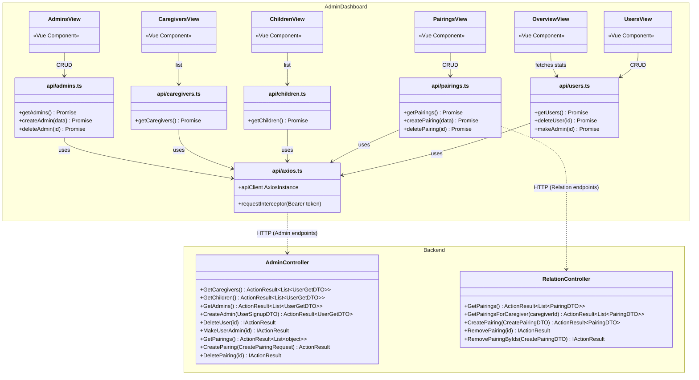
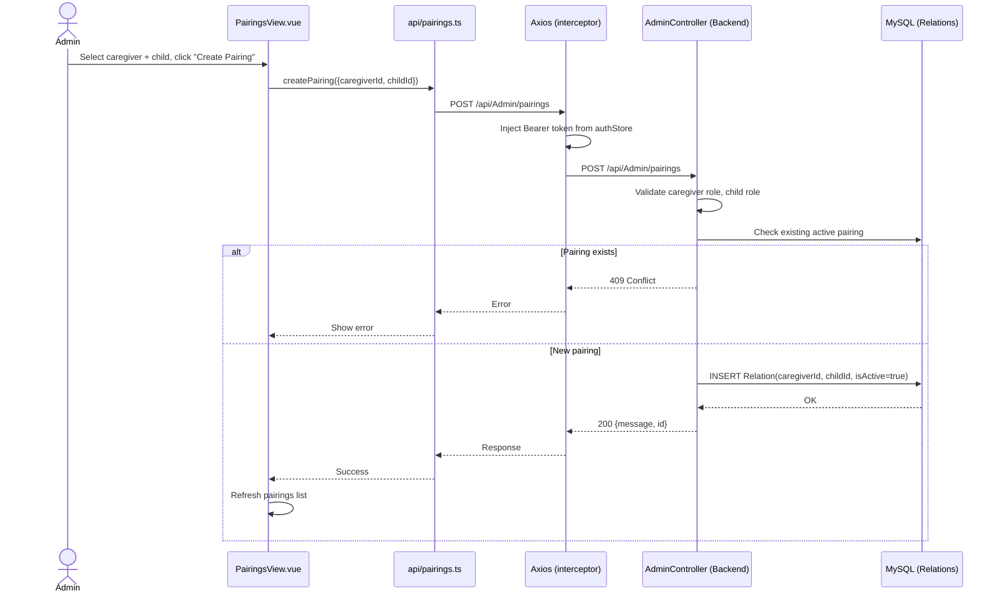

# Feature: Admin Panel

## Summary

The Admin Panel is a **Vue 3 + Pinia** single-page application (`Frontend/admin-dashboard/`) that provides administrators with user management capabilities. It communicates exclusively with the backend's **`AdminController`** (guarded by `[Authorize(Roles = "Admin")]`) and **`RelationController`** (also admin-only) for managing caregivers, children, admins, and caregiver-child pairings. The dashboard has 6 views behind a `DashboardLayout` (sidebar + header): Overview, Users, Children, Caregivers, Pairings, and Admins. Each view has a corresponding API module in `src/api/` that calls the backend through a shared Axios instance with a Bearer token interceptor. The Flutter app has no admin functionality — this is a separate web-only tool.

---

## Class Diagram (Public API Surface)

---

## Sequence Diagram — Admin Creates Caregiver-Child Pairing

---

## Architectural Concerns

| # | Concern | Severity | Detail |
|---|---------|----------|--------|
| 1 | **Duplicate pairing CRUD** | 🔴 Critical | Both `AdminController` (at `/api/Admin/pairings`) and `RelationController` (at `/api/Relation`) implement pairing CRUD with slightly different logic: Admin filters by `IsActive`, Relation returns all; different DTO shapes (anonymous object vs `PairingDTO`); different validation. **Consolidate into one controller** — likely `RelationController` with proper DTOs. |
| 2 | ~~**Mock auth bypass in production code**~~ | ✅ Resolved | Fixed in Phase 1.3 — mock token block deleted from `store/auth.ts`. Real API login now executes. |
| 3 | ~~**AdminController.DeleteUser doesn't clean up**~~ | ✅ Resolved | Fixed in Phase 1.4 — both controllers now use shared `UserCleanupHelper.DeleteUserWithAssets()` for cascade cleanup. |
| 4 | **No admin read access to content** | 🟡 Medium | Admins can manage users and pairings but cannot view artefacts, boards, or session history. For a complete admin tool, add read-only views for user content and session analytics. |
| 5 | **Anonymous DTO in AdminController.GetPairings** | 🟡 Medium | Returns `Select(p => new { ... })` instead of a proper DTO, while `RelationController` uses `PairingDTO`. Use consistent DTO types. |
| 6 | **No pagination** | 🟡 Medium | All list endpoints (`GetCaregivers`, `GetChildren`, etc.) return all records with no pagination. Will be a problem at scale. |
| 7 | **Hardcoded baseURL** | 🟡 Medium | `api/axios.ts` has `baseURL: 'https://vta.syncr.dev/api/'`. Should use an environment variable (`import.meta.env.VITE_API_URL`). |
