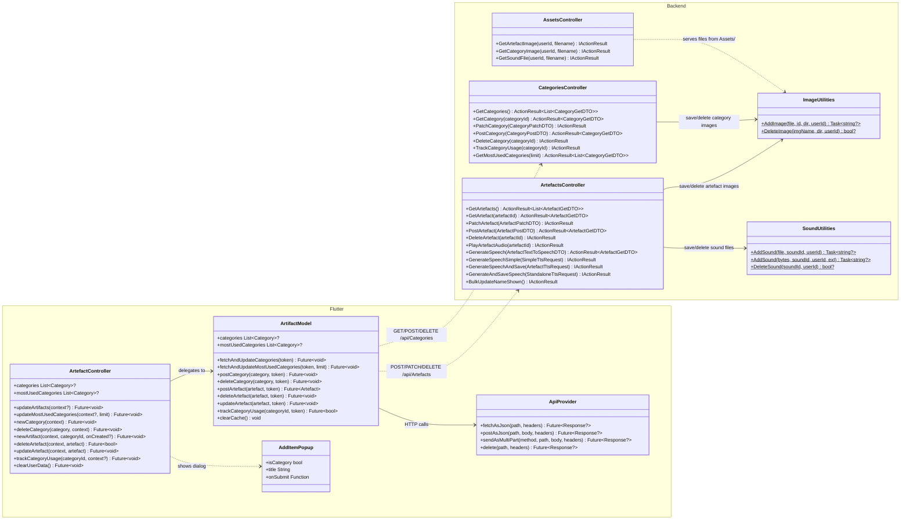
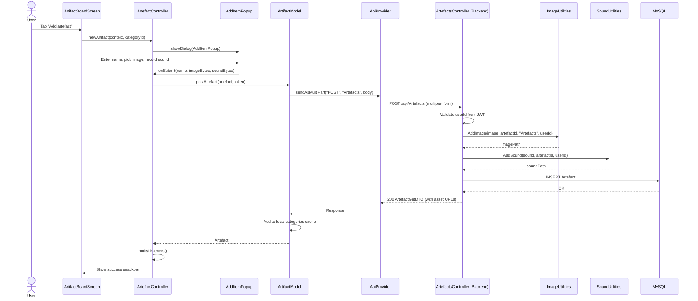
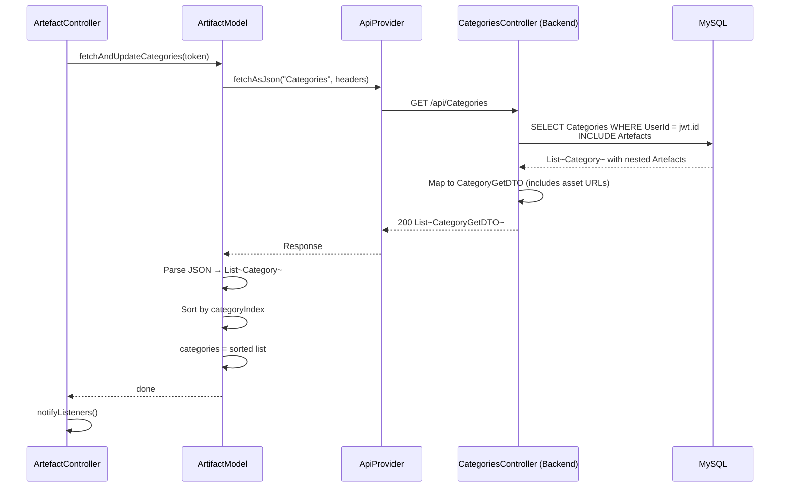

# Feature: Artifact Management

## Summary

Artifact Management is the core content system of VTA. **Artefacts** (images with optional sounds and names) are grouped into **Categories**, both owned by a user. The backend exposes two controllers — `ArtefactsController` (CRUD + TTS endpoints at `api/Artefacts`) and `CategoriesController` (CRUD + usage tracking at `api/Categories`) — with filesystem-backed asset storage via `ImageUtilities` and `SoundUtilities`, and static file serving through `AssetsController`. The Flutter app wraps these APIs in `ArtifactModel` (HTTP calls + local in-memory cache) → `ArtefactController` (UI orchestration with confirmation dialogs and snackbars). Local database stubs exist (`ArtefactRepository`, `CategoryRepository`) but are currently commented out, with all operations going through the REST API.

---

## Class Diagram (Public API Surface)

---

## Sequence Diagram — Create Artefact

---

## Sequence Diagram — Fetch Categories with Artefacts

---

## Architectural Concerns

| # | Concern | Severity | Detail |
|---|---------|----------|--------|
| 1 | **ArtefactsController is a god class (795 LOC)** | 🔴 Critical | Handles CRUD, 4 different TTS endpoints, audio playback, bulk operations, and inline `ElevenLabsService` creation. Extract TTS into a dedicated `TtsController` and use DI for `ElevenLabsService`. |
| 2 | **Commented-out local database code** | 🟠 High | `ArtifactModel` has complete local DB methods (`_postArtefactLocal`, `_deleteCategoryLocal`, etc.) all commented out. This creates confusion — either finish offline-first or remove the dead code. |
| 3 | **No backend service/repository layer** | 🟠 High | Both controllers use `VTAContext` directly (EF Core DbContext in controller). Extracting an `IArtefactService` / `ICategoryService` would improve testability and SRP. |
| 4 | **Static utility classes** | 🟡 Medium | `ImageUtilities` and `SoundUtilities` are static — cannot be mocked in tests, no DI. Convert to injectable services (e.g., `IFileStorageService`). |
| 5 | **Asset URL construction in DTOConverter** | 🟡 Medium | `DTOConverter.MapArtefactToArtefactGetDTO` receives `Request.Scheme` and `Request.Host` to build URLs. This breaks if assets move to a CDN or object storage. Centralise URL generation. |
| 6 | **Console.WriteLine in production code** | 🟡 Medium | `PostArtefact()` contains `Console.WriteLine("----" + artefactPostDTO.Name)` — debug noise. Replace with structured `ILogger`. |
| 7 | **Duplicate `updateArtifact` methods** | 🟡 Medium | `ArtefactController` has both `updateArtefact(context, artefact)` and `updateArtifact(context, artefact)` (same signature, lines 186 and 229) — one delegates to model, the other also shows snackbar. Consolidate. |
| 8 | **No authorization on AssetsController** | 🟡 Medium | Any authenticated user can fetch any other user's asset files via `GET /api/Assets/Artefacts/{userId}/{filename}` — no ownership check. |
