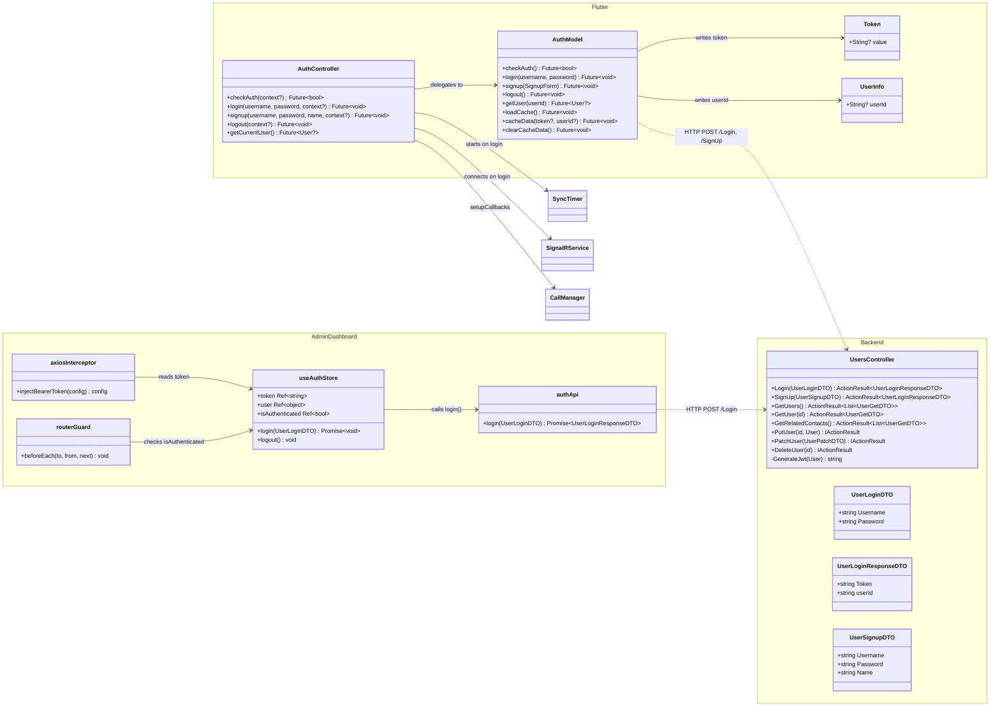
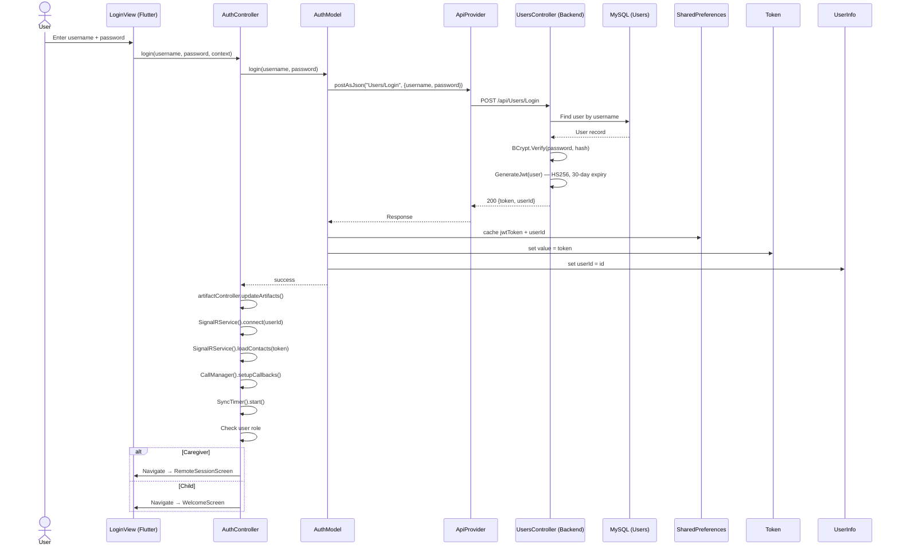
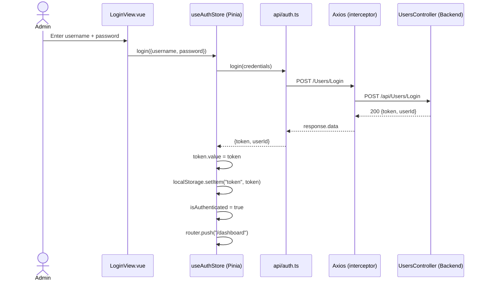

# Feature: Authentication

## Summary

Authentication spans all three stacks. The backend **`UsersController`** exposes `POST /api/Users/Login` and `POST /api/Users/SignUp` endpoints that validate credentials with BCrypt and issue HS256-signed JWTs (30-day expiry, issuer `api.vta.com`). The Flutter app wraps these calls in **`AuthModel`** (HTTP + caching via `SharedPreferences`) and **`AuthController`** (orchestrates login side-effects: sync timer, SignalR connection, call-manager setup, and navigation). The admin dashboard uses a Pinia **`useAuthStore`** backed by **`api/auth.ts`** (Axios POST), with `localStorage` token persistence and a Vue Router navigation guard (`meta.requiresAuth`). Both clients send the JWT as a `Bearer` header on all subsequent requests — the Flutter app via `ApiProvider`, the admin via an Axios request interceptor.

---

## Class Diagram (Public API Surface)

---

## Sequence Diagram — Login Flow (Flutter)

---

## Sequence Diagram — Login Flow (Admin Dashboard)

---

## Architectural Concerns

| # | Concern | Severity | Detail |
|---|---------|----------|--------|
| 1 | **Mock auth bypass in admin store** | 🔴 Critical | `store/auth.ts` has a hardcoded `token.value = 'local-mock-token'` block with a `return` before the real API call. Any push with this block uncommented means the admin panel accepts *any* credentials. This should be behind an `import.meta.env.DEV` guard or removed entirely. |
| 2 | **30-day JWT with no refresh** | 🟠 High | Tokens expire after 30 days with no refresh-token mechanism. If a token is stolen, it's valid for a month. Consider short-lived access tokens (15–60 min) + a refresh token stored in an HttpOnly cookie. |
| 3 | **AuthController tightly coupled to screens** | 🟠 High | `AuthController` imports `WelcomeScreen`, `ArtifactBoardScreen`, `RemoteSessionScreen`, `LoginView` for navigation. A controller should not depend on UI widgets — inject a navigation callback or use a router service instead. |
| 4 | **No role enforcement on backend** | 🟡 Medium | `UsersController` only checks `[Authorize]` (valid JWT). Admin-specific endpoints (e.g., `GetUsers`) lack `[Authorize(Roles = "Admin")]`. Any authenticated user can list all users. |
| 5 | **UsersController is a god class** | 🟡 Medium | 458 lines handling login, signup, CRUD, settings (PATCH), contacts, and JWT generation. Split into `AuthController` (login/signup/JWT) and `UsersController` (CRUD/settings). |
| 6 | **Custom JWT claims** | 🟡 Medium | Uses `"id"` and `"role"` as custom claim strings instead of `ClaimTypes.NameIdentifier` / `ClaimTypes.Role`. Works, but non-standard and requires `MapInboundClaims = false` to avoid mapping issues. |
| 7 | **Duplicate auth-check code path** | 🟡 Medium | `functions/auth.dart` (`AuthPage`) implements a parallel auth-check flow using `Provider` (`AuthState`, `ArtifactState`, `UserState`) that doesn't use `AuthController` at all — appears to be dead/legacy code. |
| 8 | **Duplicated login side-effects** | 🟡 Medium | `AuthController.login()` and `AuthController.checkAuth()` both contain near-identical blocks: connect SignalR → load contacts → setup callbacks. Extract a `_initializePostAuthServices()` helper. |
