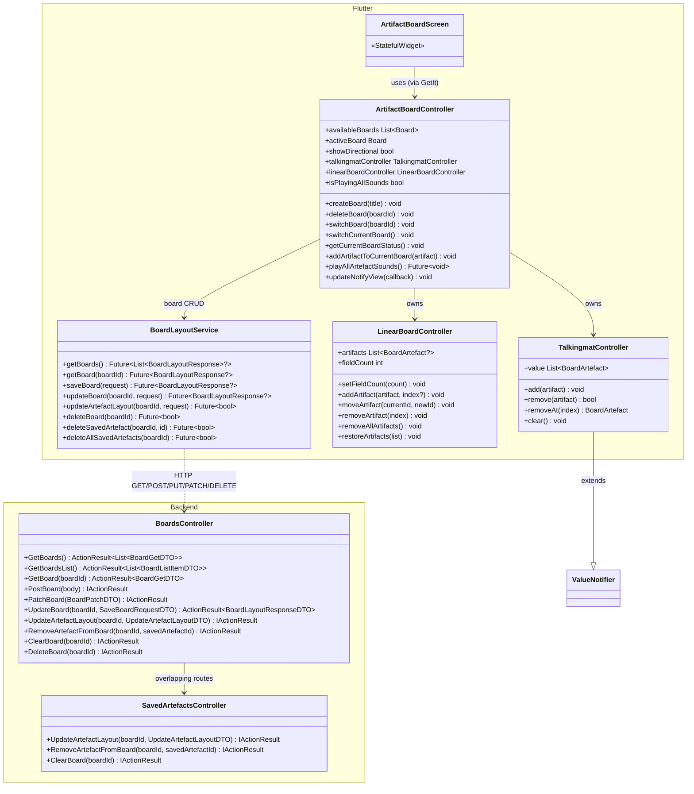
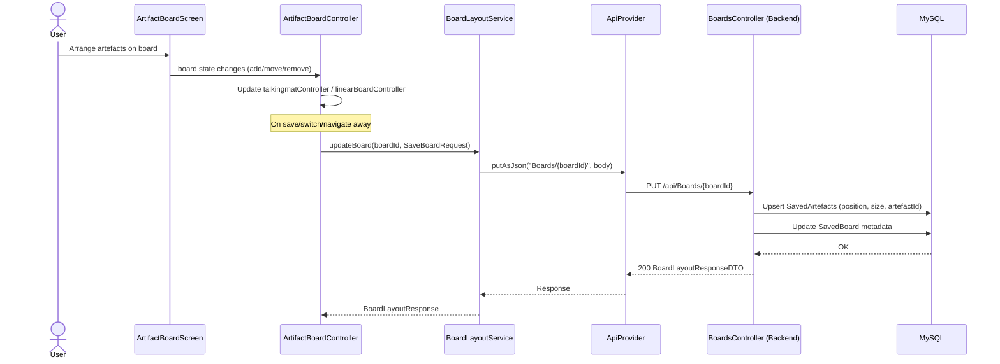
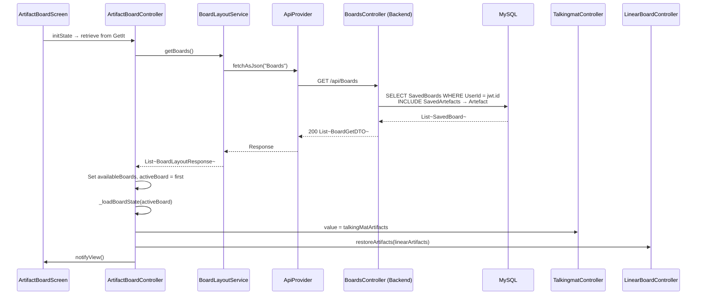

# Feature: Board System

## Summary

The Board System lets users place artefacts onto visual boards in two layout modes: **TalkingMat** (free-form drag-and-drop grid) and **LinearBoard** (fixed-slot sequential). Boards are persisted server-side via `BoardsController` (`api/Boards`) and `SavedArtefactsController` (`api/Boards/{boardId}/SavedArtefacts`), each board storing a list of `SavedArtefact` records with position/size data. On the Flutter side, `ArtifactBoardController` manages multi-board state (create/switch/delete boards), delegating layout operations to `TalkingmatController` (a `ValueNotifier<List<BoardArtefact>>`) and `LinearBoardController` (a `ChangeNotifier` with fixed-slot list). `BoardLayoutService` wraps all REST calls for board CRUD and artefact placement. The board can also play all artefact sounds sequentially. The `ArtifactBoardScreen` renders the active board and the category drawer.

---

## Class Diagram (Public API Surface)

---

## Sequence Diagram — Save Board Layout (PUT)

---

## Sequence Diagram — Load Boards on Screen Entry

---

## Architectural Concerns

| # | Concern | Severity | Detail |
|---|---------|----------|--------|
| 1 | **BoardsController is a god class (759 LOC)** | 🔴 Critical | Handles board CRUD, artefact layout updates, board clearing, snapshot management. Artefact-layout operations should live in `SavedArtefactsController` exclusively. |
| 2 | **Duplicate endpoints across controllers** | 🔴 Critical | `UpdateArtefactLayout`, `RemoveArtefactFromBoard`, and `ClearBoard` exist in **both** `BoardsController` and `SavedArtefactsController` with nearly identical implementations. One set should be removed. |
| 3 | **ArtifactBoardController (413 LOC) has too many responsibilities** | 🟠 High | Manages multi-board state, two layout modes, settings sync, and sound playback. Split sound playback into a `BoardAudioService` and multi-board management into a `BoardManager`. |
| 4 | **Inconsistent DI for ArtifactBoardController** | 🟠 High | Registered in GetIt as a singleton by string key `'ArtifactBoardController'`, but also passed around as constructor parameter. Choose one pattern. |
| 5 | **board_controller.dart is empty** | 🟡 Medium | File exists but is completely empty — should be deleted to avoid confusion. |
| 6 | **SaveBoardRequest sent as full board state** | 🟡 Medium | Every save sends the complete artefact list (PUT semantics). For large boards with many artefacts, a PATCH-based delta approach would be more efficient and reduce conflict risk. |
| 7 | **No optimistic UI updates** | 🟡 Medium | Board operations wait for server response before updating UI. For local actions (add/remove artefact), apply optimistically and reconcile on server response. |
