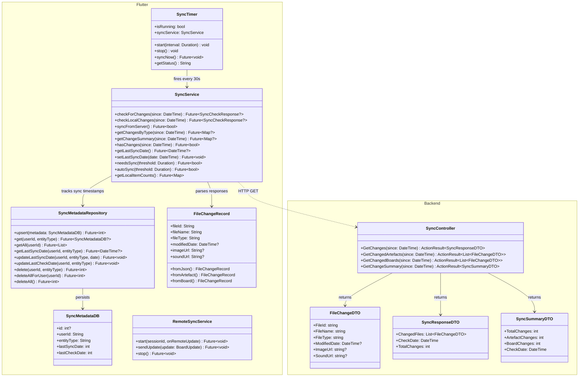
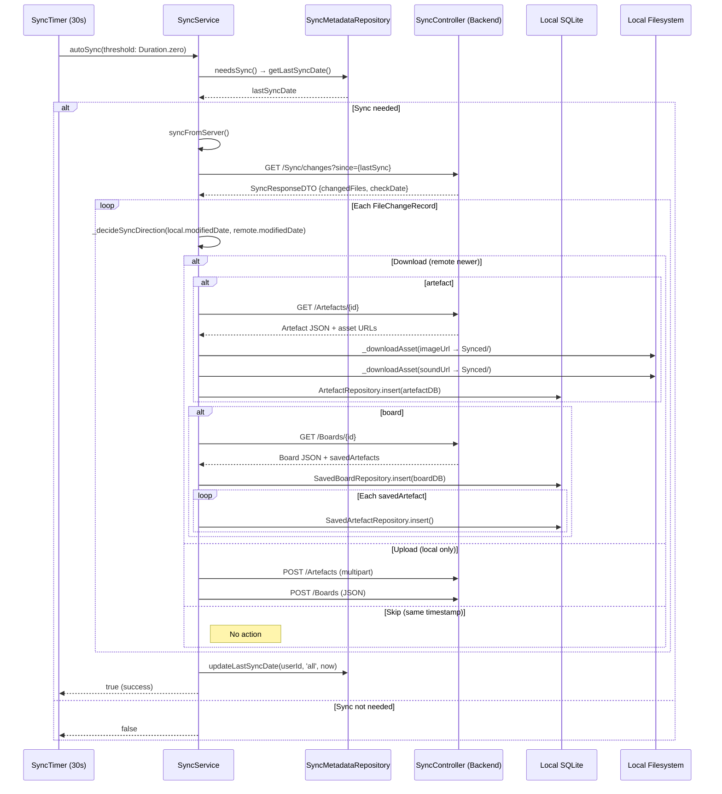
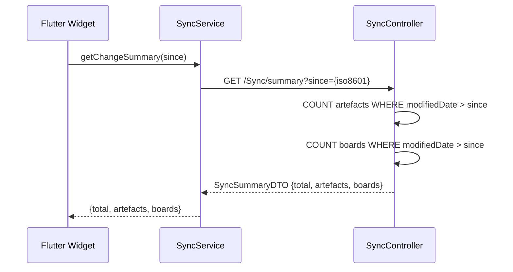

# Feature: Data Synchronisation

## Summary

The Data Sync feature provides **bidirectional, offline-first synchronisation** between the Flutter app's local SQLite database and the backend MySQL database. The backend exposes a read-only **`SyncController`** (4 GET endpoints under `api/Sync`) that returns changes since a given timestamp. The Flutter client orchestrates sync through a **`SyncService`** (1,009 LOC) that compares local vs. remote timestamps, downloads changed artefacts/categories/boards (including binary assets), and uploads local-only items. A **`SyncTimer`** singleton fires every 30 seconds by default, triggering `SyncService.autoSync()`. Per-entity-type metadata is tracked in a local `sync_metadata` SQLite table via **`SyncMetadataRepository`**. A separate **`RemoteSyncService`** handles real-time board collaboration over SignalR (documented in [Real-time Collaboration](realtime_collaboration.md)); it is _not_ part of the polling-based data sync described here.

---

## Class Diagram (Public API Surface)

---

## Sequence Diagram — Periodic Sync Cycle

---

## Sequence Diagram — Check-Only (Summary)

---

## Architectural Concerns

| # | Concern | Severity | Detail |
|---|---------|----------|--------|
| 1 | **`SyncService` is a god class** | 🔴 Critical | 1,009 lines handling API calls, file I/O, database operations, conflict resolution, and asset downloading. Split into `SyncDownloader`, `SyncUploader`, `SyncConflictResolver`, `AssetManager`. |
| 2 | **No transaction safety** | 🔴 Critical | A partial sync failure (e.g., crash mid-download) leaves the local DB in an inconsistent state. No rollback mechanism exists. Wrap each entity sync in a DB transaction. |
| 3 | **~40 `Console.WriteLine` debug statements** in SyncController | 🟠 High | Production backend logs every single sync request with verbose debug output. Replace with `ILogger` and use appropriate log levels. |
| 4 | **30-second timer with no backoff** | 🟠 High | `SyncTimer` fires every 30s with no exponential backoff on failure and no connectivity check. Will hammer the server when offline or on errors. |
| 5 | **No retry logic** | 🟠 High | Failed asset downloads or uploads are silently ignored. No retry queue or dead-letter mechanism. |
| 6 | **No pagination on sync endpoints** | 🟡 Medium | `GetChanges` returns ALL changes since timestamp in one response. Large change sets will cause memory pressure and slow responses. Add cursor-based pagination. |
| 7 | **Last-write-wins conflict resolution** | 🟡 Medium | `_decideSyncDirection` simply compares Unix timestamps. No merge strategy for concurrent edits from different devices. |
| 8 | **`FileType` is a raw string** | 🟡 Medium | `FileChangeDTO.FileType` is `string` instead of an enum. Risk of typos (`"artefact"` vs `"artifact"`). |
| 9 | **Inline model classes** | 🟡 Medium | `FileChangeRecord` and `SyncCheckResponse` are defined inside `sync_service.dart` (not in a models folder), reducing discoverability. |
| 10 | **URL construction uses `Request.Scheme` + `Request.Host`** | 🟡 Medium | Fragile behind reverse proxies. Should use `X-Forwarded-*` headers or configured base URL. |
