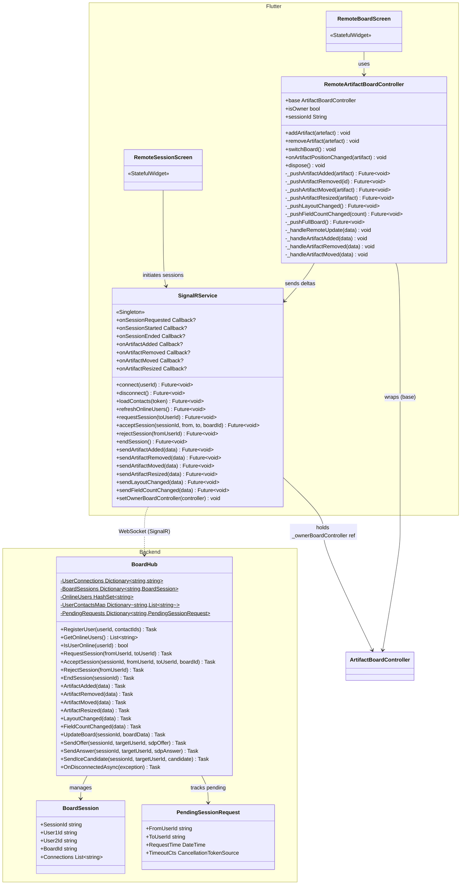
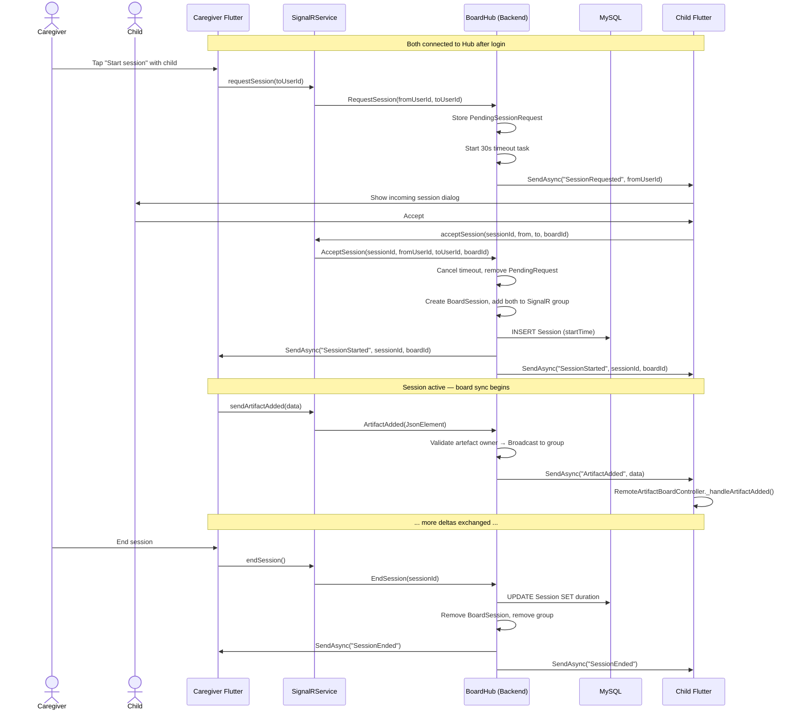

# Feature: Real-time Collaboration

## Summary

Real-time Collaboration allows a **caregiver** and **child** to share a board session over SignalR. The backend **`BoardHub`** (SignalR Hub) manages session lifecycle (request → accept/reject → end), tracks online users with static dictionaries, and relays per-artefact delta events (`ArtifactAdded`, `ArtifactRemoved`, `ArtifactMoved`, `ArtifactResized`, `LayoutChanged`, `FieldCountChanged`). On the Flutter side, **`SignalRService`** (manual singleton) maintains the Hub connection, registers event handlers, and exposes send methods. **`RemoteArtifactBoardController`** (1,209 LOC — the largest file in the codebase) wraps `ArtifactBoardController`, intercepts local board mutations, debounces them, and pushes deltas over SignalR while also applying incoming remote deltas to the local board. Sessions are logged to the database with start/end timestamps for analytics.

---

## Class Diagram (Public API Surface)

---

## Sequence Diagram — Session Lifecycle (Request → Accept → Collaborate → End)

---

## Architectural Concerns

| # | Concern | Severity | Detail |
|---|---------|----------|--------|
| 1 | **RemoteArtifactBoardController is 1,209 LOC** | 🔴 Critical | The largest file in the codebase. Handles delta serialization, debouncing, position/size change tracking, remote event handling, and full-board sync. Decompose into: `DeltaSyncManager` (push/receive deltas), `DebounceManager` (position/size debouncing), `RemoteBoardEventHandler` (incoming event processing). |
| 2 | **Static mutable state in BoardHub** | 🔴 Critical | `UserConnections`, `BoardSessions`, `OnlineUsers`, etc. are `static readonly Dictionary` — **not thread-safe** (should use `ConcurrentDictionary`) and **not scalable** to multiple server instances. For multi-instance deployment, use Redis-backed SignalR backplane with distributed state. |
| 3 | **SignalRService holds reference to ArtifactBoardController** | 🟠 High | `_ownerBoardController` field creates tight coupling between the service layer and controller layer. Use event callbacks or a mediator pattern instead. |
| 4 | **BoardHub is 584 LOC with too many responsibilities** | 🟠 High | Manages sessions, online status, board sync, WebRTC signaling relay, and DB writes. Split into: `SessionHub` (lifecycle), `BoardSyncHub` (delta relay), `WebRTCRelayHub` (signaling). |
| 5 | **No conflict resolution for concurrent board edits** | 🟠 High | If both users move the same artefact simultaneously, last-write-wins. No operational transform or CRDT mechanism. For this use case, consider locking or last-writer-wins with visual feedback. |
| 6 | **Console.WriteLine spam** | 🟡 Medium | ~30 `Console.WriteLine` calls in `BoardHub`. Replace with structured `ILogger<BoardHub>` for proper log levels and filtering. |
| 7 | **30s timeout uses Task.Run with captured Hub context** | 🟡 Medium | The timeout task in `RequestSession` captures `Clients` from the Hub context, which may be disposed after the Hub method returns. Use `IHubContext<BoardHub>` injected via DI for out-of-band sends. |
| 8 | **SignalRService is 532 LOC** | 🟡 Medium | Manages connection lifecycle, user registration, session initiation, delta sending, WebRTC relay, online status, and contact caching. Split into focused services. |
