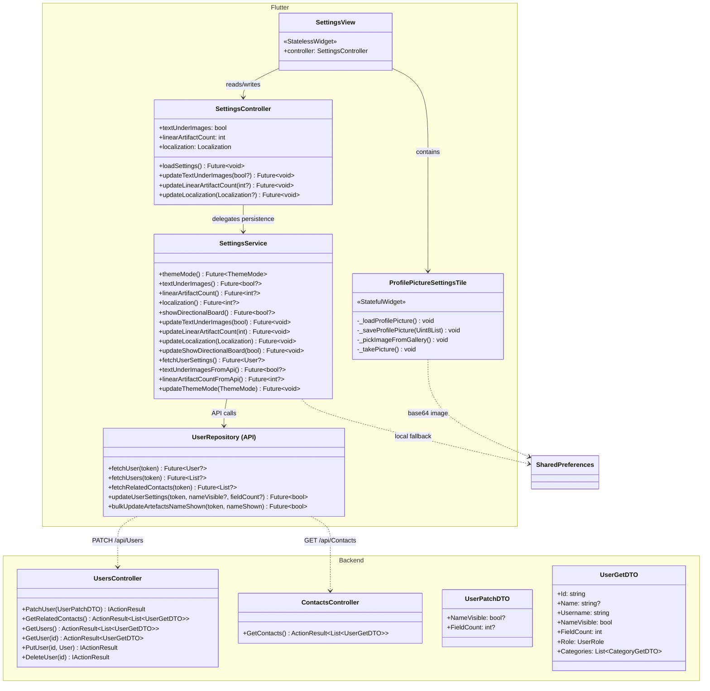
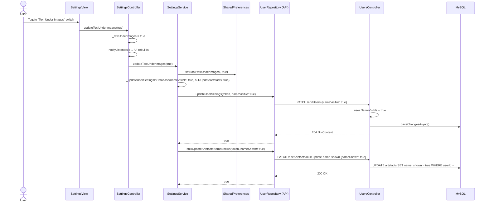
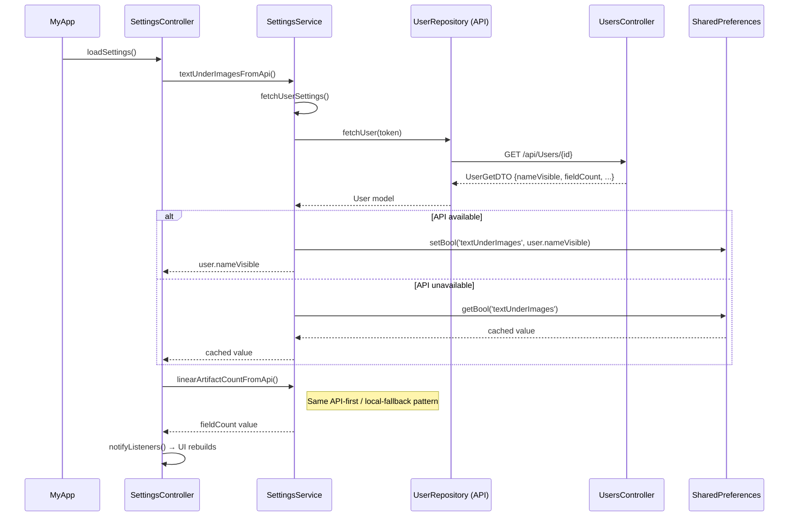
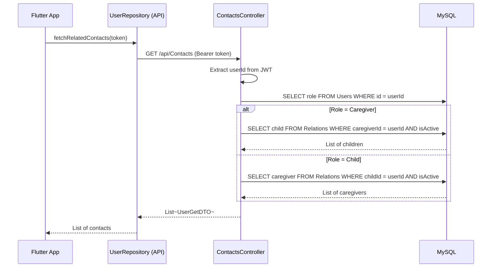

# Feature: Settings & User Management

## Summary

Settings & User Management covers **user profile configuration** and **contact/relationship lookup**. The Flutter app's **`SettingsController`** (ChangeNotifier) exposes two user-facing settings — *Text Under Images* (`NameVisible`) and *Linear Artifact Count* (`FieldCount`) — persisted to both `SharedPreferences` (local) and the backend via **`PATCH /api/Users`**. The **`SettingsService`** implements a dual-storage strategy: API-first loading with local fallback. Profile pictures are stored **only** in `SharedPreferences` (as base64 strings) and are never synced. The backend's **`ContactsController`** and the duplicate `UsersController.GetRelatedContacts` endpoint return role-aware contact lists (caregiver→children, child→caregivers). A `Localization` enum exists in the controller but the UI setting is **commented out**.

---

## Class Diagram (Public API Surface)

---

## Sequence Diagram — Update "Text Under Images" Setting

---

## Sequence Diagram — Load Settings on App Start

---

## Sequence Diagram — Get Contacts (Role-Based)

---

## Architectural Concerns

| # | Concern | Severity | Detail |
|---|---------|----------|--------|
| 1 | **Duplicate contacts endpoint** | 🟠 High | `ContactsController.GetContacts()` (route `api/Contacts`) and `UsersController.GetRelatedContacts()` (route `api/Users/related-contacts`) contain nearly identical role-based contact logic. Consolidate into one. |
| 2 | **Profile picture not synced** | 🟠 High | `_ProfilePictureSettingsTile` stores the image as base64 in `SharedPreferences` only. Switching devices or clearing app data loses the profile picture. Should sync to backend. |
| 3 | **Base64 image in SharedPreferences** | 🟡 Medium | Storing a full-resolution photo as base64 in SharedPreferences is memory-inefficient and can slow app startup. Use file storage with a path reference. |
| 4 | **No validation on PATCH** | 🟡 Medium | `PatchUser` accepts any `FieldCount` value including negatives or zero. Add `[Range]` validation attributes to `UserPatchDTO`. |
| 5 | **Localization setting commented out** | 🟡 Medium | `SettingsController.loadSettings()` has the localization loading fully commented out. The `Localization` enum and `updateLocalization()` method exist but the UI toggle was removed. Either complete or remove. |
| 6 | **Silent failures in SettingsService** | 🟡 Medium | `_updateUserSettingsInDatabase` has empty `catch` blocks and missing log messages (`if (!success) { return; }`). Failures are swallowed with no user feedback. |
| 7 | **`themeMode()` is a stub** | 🟢 Low | Always returns `ThemeMode.system`. `updateThemeMode()` is a no-op. Either implement or remove from the API surface. |
| 8 | **Hardcoded Danish strings** | 🟡 Medium | `SettingsView` uses hardcoded Danish text ("Profilbillede", "Vælg profilbillede") instead of using the app's l10n system. |
| 9 | **Unused DI injections** | 🟢 Low | `ContactsController` injects `IConfiguration` and `ILogger` via primary constructor but `IConfiguration` is never used. |
