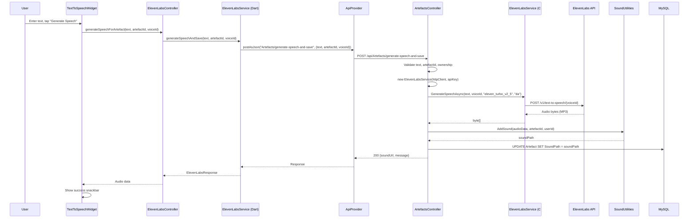

# Feature: Text-to-Speech

## Summary

Text-to-Speech (TTS) generates audio from artefact names using the **ElevenLabs API**, providing spoken word accompaniment for visual artefacts. All TTS requests are **proxied through the backend** — the Flutter app never contacts ElevenLabs directly. The backend exposes 4 TTS endpoints on `ArtefactsController`, which creates an `ElevenLabsService` inline (no DI), generates audio via the ElevenLabs API, and either returns the audio directly or saves it to the filesystem. The Flutter `ElevenLabsController` → `ElevenLabsService` (Dart) calls the backend proxy endpoints. `ElevenLabsConfig` stores only local voice-ID preferences (no API key). Both sides use the default Danish voice ID (`Bj9UqZbhQsanLzgalpEG`).

> **Phase 1.5 change (Feb 2026):** The direct client-side ElevenLabs path was removed. The Flutter app no longer stores or sends an API key. All TTS flows through the backend proxy.

---

## Class Diagram (Public API Surface)

```mermaid
classDiagram
    direction TB

    %% ── Backend ──────────────────────────────────
    namespace Backend {
        class ArtefactsController {
            +GenerateSpeechSimple(SimpleTtsRequest) IActionResult
            +GenerateSpeechAndSave(ArtefactTtsRequest) IActionResult
            +GenerateAndSaveSpeech(StandaloneTtsRequest) IActionResult
            +GenerateSpeech(ArtefactTextToSpeechDTO) ActionResult~ArtefactGetDTO~
            +PlayArtefactAudio(artefactId) IActionResult
            -ResolveVoiceId(voiceId?) string
        }
        class ElevenLabsService_Backend["ElevenLabsService (C#)"] {
            +DefaultVoiceId string$
            +GenerateSpeechAsync(text, voiceId?, modelId?, langCode?) Task~byte[]?~
            +GetVoicesAsync() Task~string?~
            +GetUserInfoAsync() Task~string?~
            +ValidateApiKeyAsync() Task~bool~
        }
        class SoundUtilities {
            +AddSound(bytes, soundId, userId, ext)$ Task~string?~
        }
    }

    %% ── Flutter ──────────────────────────────────
    namespace Flutter {
        class ElevenLabsController {
            +isLoading bool
            +isConfigured bool
            +lastError String?
            +initialize(ApiProvider, String token) void
            +generateSpeech(text, voiceId?) Future~ElevenLabsResponse?~
            +generateSpeechForArtefact(text, artefactId, voiceId?) Future~Uint8List?~
        }
        class ElevenLabsService_Flutter["ElevenLabsService (Dart)"] {
            -_apiProvider ApiProvider
            -_token String
            +generateSpeech(text, voiceId) Future~ElevenLabsResponse~
            +generateSpeechAndSave(text, artefactId, voiceId) Future~ElevenLabsResponse~
        }
        class ElevenLabsConfig {
            +defaultVoiceId String$
            +alternateVoiceId String$
            +availableVoiceIds List~String~$
            +getDefaultVoiceId()$ Future~String~
            +setDefaultVoiceId(id)$ Future~void~
        }
        class TextToSpeechWidget {
            «StatefulWidget»
        }
    }

    %% ── External ─────────────────────────────────
    namespace External {
        class ElevenLabsAPI {
            POST /v1/text-to-speech/{voiceId}
        }
    }

    %% ── Relationships ────────────────────────────
    ArtefactsController --> ElevenLabsService_Backend : creates inline (new)
    ElevenLabsService_Backend ..> ElevenLabsAPI : HTTPS
    ArtefactsController --> SoundUtilities : saves generated audio

    ElevenLabsController --> ElevenLabsService_Flutter : delegates to
    ElevenLabsController --> ElevenLabsConfig : reads voice preferences
    ElevenLabsService_Flutter ..> ArtefactsController : HTTP (backend proxy)

    TextToSpeechWidget --> ElevenLabsController : uses
```

---

## Sequence Diagram — TTS via Backend Proxy (generate-speech-and-save)



---

## Architectural Concerns

| # | Concern | Severity | Detail |
|---|---------|----------|--------|
| 1 | ~~**Dual TTS path — backend AND client-side**~~ | ✅ Resolved | Consolidated to backend-only in Phase 1.5. Flutter now proxies all TTS through the backend. |
| 2 | ~~**API key stored on client device**~~ | ✅ Resolved | `ElevenLabsConfig` no longer stores an API key. Only voice-ID preferences remain. |
| 3 | **ElevenLabsService created inline (no DI)** | 🟠 High | `ArtefactsController` does `new ElevenLabsService(httpClient, apiKey)` in each TTS method. This is not testable and doesn't follow the .NET DI pattern. Register `ElevenLabsService` via `builder.Services.AddScoped<ElevenLabsService>()`. |
| 4 | **4 overlapping TTS endpoints** | 🟠 High | `generate-speech-simple`, `generate-speech-and-save`, `generate-and-save-speech`, and `generate-speech` all do variations of the same thing. Consolidate into 1–2 endpoints (one that returns audio, one that saves to artefact). |
| 5 | **Hardcoded allowed voice IDs** | 🟡 Medium | `ArtefactsController` has a static `AllowedVoiceIds` HashSet with two hardcoded IDs. Make this configurable via `appsettings.json`. |
| 6 | **TTS in ArtefactsController** | 🟡 Medium | TTS logic (325 lines) is embedded in the 795-line `ArtefactsController`. Extract into a dedicated `TtsController` with its own route (`api/Tts`). |
| 7 | **No caching of generated audio** | 🟡 Medium | The same text can be sent for TTS generation multiple times, each consuming ElevenLabs API credits. Consider caching by text+voiceId hash. |
