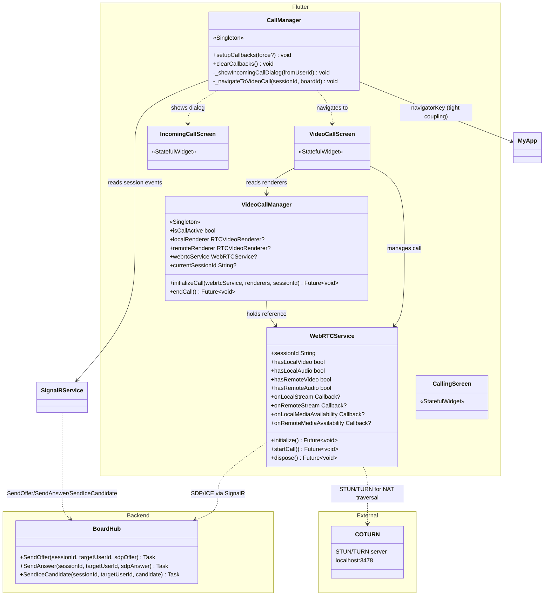
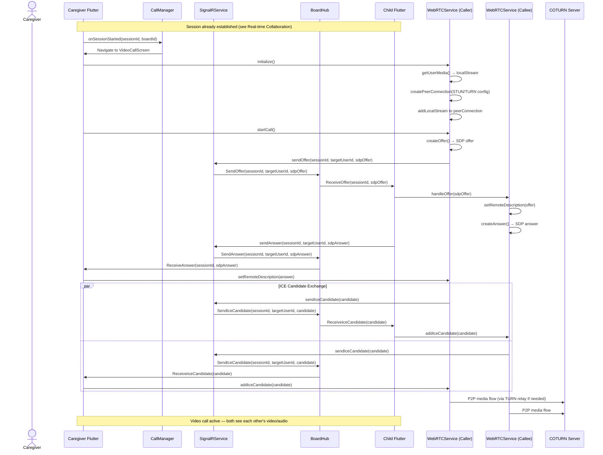

# Feature: Video Calling

## Summary

Video Calling is layered on top of Real-time Collaboration. Once a session is established via `BoardHub`, a peer-to-peer WebRTC connection is negotiated through SignalR signaling (offer/answer/ICE candidate relay). On the Flutter side, **`WebRTCService`** manages the `RTCPeerConnection`, local/remote media streams, and STUN/TURN configuration (currently hardcoded to `localhost:3478`). **`CallManager`** (singleton) bridges SignalR session events to UI navigation — showing an incoming-call dialog or navigating to `VideoCallScreen`. **`VideoCallManager`** (singleton) persists WebRTC renderers and service references across screen transitions so the video call survives navigation between `VideoCallScreen` and `RemoteBoardScreen`. The backend simply relays SDP offers, answers, and ICE candidates between the two session participants via SignalR group messaging.

---

## Class Diagram (Public API Surface)

---

## Sequence Diagram — Establish Video Call

---

## Architectural Concerns

| # | Concern | Severity | Detail |
|---|---------|----------|--------|
| 1 | **Hardcoded TURN credentials and localhost URLs** | 🔴 Critical | `WebRTCService` has `username: 'testuser'`, `credential: 'testpass'`, `urls: 'stun:localhost:3478'`. This will **not work** in production or across networks. Must be configurable via environment/config (ideally use a TURN credential provisioning API with short-lived tokens). |
| 2 | **CallManager tightly coupled to app root** | 🟠 High | `CallManager` imports `MyApp` and uses `MyApp.navigatorKey.currentContext` for navigation. If the app is restructured or the navigator key changes, calls break silently. Use a navigation service abstraction injected via DI. |
| 3 | **WebRTCService takes raw HubConnection** | 🟠 High | Creates coupling between WebRTC and SignalR implementations. If the signaling transport changes (e.g., to WebSocket or Firebase), `WebRTCService` needs rewriting. Abstract signaling behind an interface (`ISignalingService`). |
| 4 | **No call state machine** | 🟡 Medium | Call state transitions (idle → ringing → connecting → connected → ended) are implicit across `CallManager`, `SignalRService`, and `VideoCallManager`. A formal state machine would prevent invalid transitions and race conditions. |
| 5 | **Graceful degradation is ad-hoc** | 🟡 Medium | `WebRTCService._requestUserMedia()` has a cascade fallback (video+audio → video-only → audio-only → no media) but the UI doesn't clearly communicate which mode the call is in. |
| 6 | **VideoCallManager is thin (52 LOC)** | 🟢 Low | Currently just a state holder. Consider whether `WebRTCService` itself could persist across screen transitions, eliminating the need for a separate manager. |
